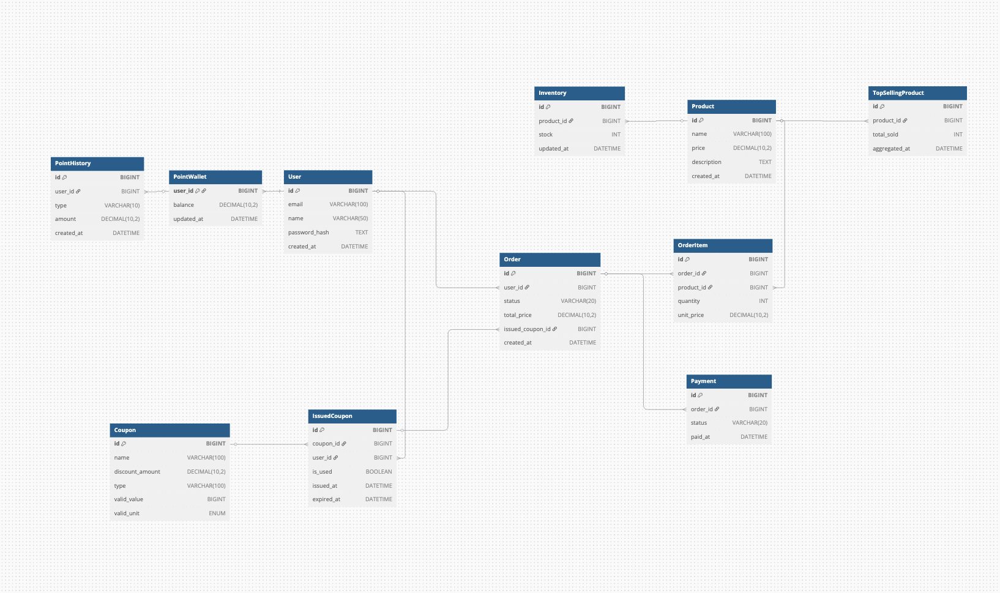

# 🛒 e-커머스 상품 주문 서비스

사용자는 상품을 조회하고, 원하는 상품을 주문할 수 있으며, 충전한 잔액으로 결제를 진행합니다.  
주문 시 쿠폰 사용이 가능하며, 최근 인기 상품 정보를 확인할 수 있습니다.

---

## 기능 요구사항

### 1. 잔액 충전 및 조회 API
- 사용자는 자신의 잔액을 충전할 수 있습니다.
- 사용자 식별자를 통해 현재 보유 중인 잔액을 조회할 수 있습니다.

### 2. 상품 조회 API
- 상품의 ID, 이름, 가격, 잔여수량을 조회할 수 있습니다.
- 상품별 잔여 수량은 조회 시점의 최신 상태를 반영해야 합니다.

### 3. 선착순 쿠폰 API
- 사용자는 선착순으로 할인 쿠폰을 발급받을 수 있습니다.
- 보유 중인 쿠폰 목록을 조회할 수 있습니다.
- 쿠폰은 주문 시 제출 가능하며, 전체 주문금액에 대해 할인 혜택을 제공합니다.

### 4. 주문 / 결제 API
- 사용자 식별자와 함께 (상품 ID, 수량) 목록을 입력받아 주문 및 결제를 수행합니다.
- 결제는 미리 충전된 잔액을 기반으로 진행되며, 성공 시 잔액이 차감됩니다.
- 결제 성공 시 주문 정보를 외부 데이터 플랫폼에 실시간 전송해야 합니다.  
  (※ 데이터 플랫폼은 애플리케이션 외부 시스템이며, 전송 방식은 Mock API 또는 Fake Module 등으로 대체 가능)

### 5. 인기 상품 조회 API
- 최근 3일간 가장 많이 판매된 상위 5개 상품을 조회할 수 있습니다.

---

## 테스트 요구사항

- 각 기능에 대해 단위 테스트(Unit Test)를 하나 이상 반드시 작성합니다.

---

## 비기능 요구사항 (심화)

- **정확한 재고 관리**: 주문 시 상품의 재고가 정확히 반영되어야 합니다.
- **동시성 처리**: 다수 사용자가 동시에 주문하더라도 데이터의 일관성이 유지되어야 합니다.
- **확장성**: 다수의 인스턴스에서 애플리케이션이 구동되어도 문제 없이 기능이 동작해야 합니다.
- **외부 시스템 연동**: 주문 정보는 외부 데이터 플랫폼으로 실시간 전송되어야 하며, 테스트 시 Mock 또는 Fake Module 등을 사용할 수 있어야 합니다.

---

## 도메인 모델링

↪︎ [drawio 파일](./docs/diagrams/domainModeling/e-commerce-domain-modeling.drawio)

### 도메인 모델링 요약 

### 1. **Product (상품)**
- 시스템의 판매 대상
- 하나의 `Product`는 최소 0 부터 여러 `Inventory`(재고)를 가진다
- 주문 시 참조된다

---

### 2. **Inventory (재고)**
- 상품별 수량 상태를 나타낸다
- 하나의 `Product`에 연결된다
- 주문 시 재고 감소한다

---

### 3. **Order (주문)**
- 사용자가 구매 요청한 정보
- 여러 상품과 연결됨 (OrderItem 개념은 생략)
- 하나의 `Order`는 하나의 `Payment`로 이어진다

---

### 4. **Payment (결제)**
- 주문 금액 지불
- 포인트와 쿠폰 사용을 포함할 수 있다
- 결제가 완료되면 주문 상태 전이 발생한다

---

### 5. **Point (포인트)**
- 사용자별 충전 잔액
- 결제 시 차감된다
- `Payment`에 의해 영향을 받는다

---

### 6. **Coupon (쿠폰)**
- 할인 정책을 정의
- 사용자는 `IssuedCoupon`을 가지고 있다
- 결제 시 적용될 수 있다

---

### 7. **Analytics (통계)**
- `Order` 를 기반으로 상품별 통계를 집계
- 최근 3일간 인기 상품 집계 기능 제공한다

---

## 시퀀스 다이어그램

### 포인트

- **포인트 충전**  
    
  ↪︎ [PlantUML 소스](./docs/diagrams/sequenceDiagram/point-charge.txt)

- **포인트 사용**  
    
  ↪︎ [PlantUML 소스](./docs/diagrams/sequenceDiagram/point-use.txt)

- **포인트 잔액 조회**  
    
  ↪︎ [PlantUML 소스](./docs/diagrams/sequenceDiagram/point-balance.txt)

---

### 상품

- **상품 목록 조회**  
    
  ↪︎ [PlantUML 소스](./docs/diagrams/sequenceDiagram/product-list.txt)

- **상품 상세 조회**  
    
  ↪︎ [PlantUML 소스](./docs/diagrams/sequenceDiagram/product-detail-inventory.txt)

---

### 주문

- **주문 생성**  
    
  ↪︎ [PlantUML 소스](./docs/diagrams/sequenceDiagram/order-only.txt)

---

### 결제

- **결제**  
    
  ↪︎ [PlantUML 소스](./docs/diagrams/sequenceDiagram/payment_v.0.2.txt)

---

### 쿠폰

- **쿠폰 선착순 발급**  
    
  ↪︎ [PlantUML 소스](./docs/diagrams/sequenceDiagram/coupon-first-come-first-served.txt)

- **보유 쿠폰 조회**  
    
  ↪︎ [PlantUML 소스](./docs/diagrams/sequenceDiagram/coupon-user-have-list.txt)

---

### 통계

- **최근 3일 상위 5개 상품 조회**  
    
  ↪︎ [PlantUML 소스](./docs/diagrams/sequenceDiagram/top5-statistics.txt)

---

## ERD

↪︎ [dbdiagram 소스](./docs/diagrams/erd/e-commerce-erd-cart.txt)

---

## 클래스 다이어그램

↪︎ [plantUML 소스](./docs/diagrams/classDiagram/e-commerce-class-diagram.txt) 
