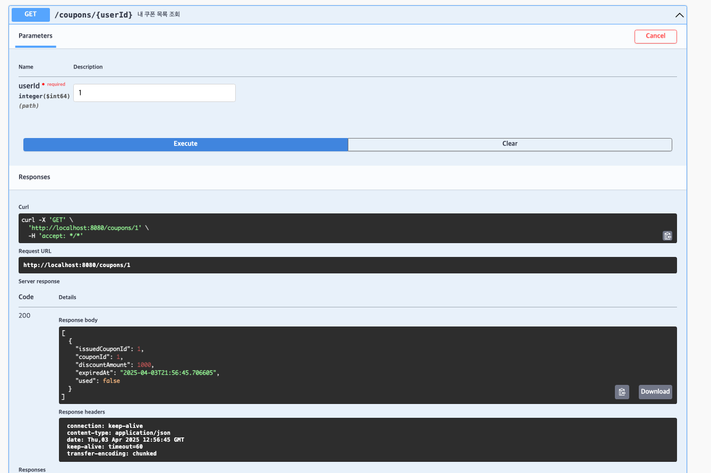

# 🧾 e-Commerce API 명세서

> 작성 기준: Controller 직접 하드코딩 구현  
> 포맷: JSON, 인코딩 UTF-8

---

## 📌 공통 정보

- **Base URL**: `http://localhost:8080`
- **Content-Type**: `application/json`
- **응답 포맷**: JSON

---

## 1️⃣ 잔액 충전 API

| 항목 | 내용 |
|------|------|
| URL | `/balance/charge` |
| Method | `POST` |
| 설명 | 사용자 잔액을 충전합니다 |

### ✅ Request Body

```json
{
  "userId": 1,
  "amount": 5000
}
```

| 필드명 | 타입 | 설명 |
|--------|------|------|
| userId | Long | 사용자 ID |
| amount | BigDecimal | 충전할 금액 |

### ✅ Response

- `200 OK`

### ⚠️ 에러
| 상태 코드 | 에러 코드 | 설명 |
|------------|------------|------|
| 400 | INVALID_REQUEST | 잘못된 요청 형식 또는 음수 금액 |
| 404 | USER_NOT_FOUND | 존재하지 않는 사용자 |


---

## 2️⃣ 잔액 조회 API

| 항목 | 내용 |
|------|------|
| URL | `/balance/{userId}` |
| Method | `GET` |
| 설명 | 사용자 잔액을 조회합니다 |

### ✅ Path Parameter

| 이름 | 타입 | 설명 |
|------|------|------|
| userId | Long | 사용자 ID |

### ✅ Response

```json
{
  "userId": 1,
  "balance": 12000
}
```
### ⚠️ 에러
| 상태 코드 | 에러 코드 | 설명 |
|------------|------------|------|
| 400 | INVALID_REQUEST | 잘못된 요청 형식 또는 음수 금액 |
| 404 | USER_NOT_FOUND | 존재하지 않는 사용자 |

---

## 3️⃣ 상품 조회 API

| 항목 | 내용 |
|------|------|
| URL | `/products` |
| Method | `GET` |
| 설명 | 모든 상품을 조회합니다 |

### ✅ Response

```json
[
  {
    "productId": 1,
    "name": "맥북",
    "price": 2000000,
    "stock": 10,
    "description": "애플 노트북"
  },
  {
    "productId": 2,
    "name": "에어팟",
    "price": 200000,
    "stock": 30,
    "description": "애플 이어폰"
  }
]
```

---

## 4️⃣ 주문 생성 및 결제 API

| 항목 | 내용 |
|------|------|
| URL | `/orders` |
| Method | `POST` |
| 설명 | 상품을 주문하고 결제합니다 |

### ✅ Request Body

```json
{
  "userId": 1,
  "items": [
    {
      "productId": 1,
      "productOptionId": null,
      "quantity": 2
    }
  ]
}
```

| 필드명 | 타입 | 설명 |
|--------|------|------|
| userId | Long | 주문자 ID |
| items | List | 주문 상품 목록 |

### ✅ Response

```json
{
  "orderId": 10001,
  "paymentId": 50001,
  "finalAmount": 27000
}
```
### ⚠️ 에러
| 상태 코드 | 에러 코드 | 설명 |
|------------|------------|------|
| 400 | INVALID_REQUEST | 필드 누락/잘못된 형식 |
| 404 | PRODUCT_NOT_FOUND | 존재하지 않는 상품 ID |
| 409 | PRODUCT_OUT_OF_STOCK | 상품 재고 부족 |
| 422 | INSUFFICIENT_BALANCE | 포인트 잔액 부족 |
| 422 | COUPON_INVALID | 쿠폰이 유효하지 않음 or 이미 사용됨 |

---

## 5️⃣ 쿠폰 발급 API

| 항목 | 내용 |
|------|------|
| URL | `/coupons/issue/{userId}` |
| Method | `POST` |
| 설명 | 사용자에게 선착순 쿠폰을 발급합니다 |

### ✅ Path Parameter

| 이름 | 타입 | 설명 |
|------|------|------|
| userId | Long | 사용자 ID |

### ✅ Response

- `200 OK`: 쿠폰 발급 완료  
- `429 Too Many Requests`: 쿠폰 소진

### ⚠️ 에러
| 상태 코드 | 에러 코드 | 설명 |
|------------|------------|------|
| 429 | COUPON_EXHAUSTED | 쿠폰 수량 초과로 발급 실패 |
| 404 | USER_NOT_FOUND | 사용자 없음 |

---

## 6️⃣ 보유 쿠폰 조회 API

| 항목 | 내용 |
|------|------|
| URL | `/coupons/{userId}` |
| Method | `GET` |
| 설명 | 사용자의 보유 쿠폰 목록을 조회합니다 |

### ✅ Response

```json
[
  {
    "issuedCouponId": 1,
    "couponId": 1,
    "discountAmount": 1000,
    "isUsed": false,
    "expiredAt": "2025-04-10T23:59:59"
  }
]
```

### ⚠️ 에러
| 상태 코드 | 에러 코드 | 설명 |
|------------|------------|------|
| 404 | USER_NOT_FOUND | 존재하지 않는 사용자 |

---

## 7️⃣ 인기 상품 조회 API

| 항목 | 내용 |
|------|------|
| URL | `/stats/top-products` |
| Method | `GET` |
| 설명 | 최근 3일간 가장 많이 판매된 상품 상위 5개를 조회합니다 |

### ✅ Response

```json
[
  {
    "productId": 1,
    "productName": "맥북",
    "totalSold": 150
  },
  {
    "productId": 2,
    "productName": "에어팟",
    "totalSold": 120
  }
]
```

## Swagger 
- 포인트 충전 
- 포인트 조회 
- 쿠폰 목록 조회 
- 쿠폰 선착순 발행 
- 주문/결제 
- 전체 상품 조회 
- 인기 상품 조회 
